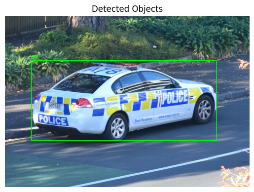

# 📦 Openimages Object Detection System with GUI

## 📌 Project Objective

The goal of this project is to **design and implement a complete object detection system** with a graphical user interface (GUI). The system allows the user to:

* Upload a static image.
* Detect one or more objects relevant to a specific domain.
* Draw bounding boxes around each detected object.
* Label each object with its predicted class.

---

## 📂 Dataset Information

* **Dataset Name**: Open Images Dataset V6
* **Source**: [Open Images Dataset](https://storage.googleapis.com/openimages/web/index.html)
* **Installation**:

  ```bash
  pip install openimages
  oi_download_dataset --base_dir ./openimages --labels "Apple" "Banana" "Car" "Dog" "Person" "Chair" "Bicycle" --limit 1000 --format pascal
  ```
* **Number of Classes**: 7

  * Apple, Banana, Car, Dog, Person, Chair, Bicycle
* **Number of Samples**: 7,000 (1,000 per class)
* **Purpose**: Provides a diverse and well-annotated set of images ideal for training and evaluating object detection models across multiple common object categories.

---

## 🔧 Pipeline Implementation

The project pipeline consists of the following steps:

### 1. Preprocessing and Image Enhancement

**Tasks**:

* Image resizing to a standard size (e.g., 256x256)
* Normalization to scale pixel values to \[0, 1]
* Noise reduction using Gaussian blur
* Contrast adjustment using CLAHE
* Color space conversion to grayscale and HSV
* Morphological operations (e.g., opening and closing)

**Techniques**:
Used OpenCV functions: `cv2.resize`, `cv2.GaussianBlur`, `cv2.createCLAHE`, etc.

---

### 2. Segmentation

**Tasks**: Isolate regions of interest (ROIs) that may contain objects.

**Techniques**:

* Thresholding (Otsu's method)
* Edge-based methods (Canny edge detection)
* Clustering (K-means)
* Region-based methods (Region Growing)
* **Watershed segmentation** (selected as the best method)

---

### 3. Feature Extraction

**Tasks**: Extract relevant features from segmented regions.

**Techniques**:

* Color histograms (HSV)
* Texture features (Local Binary Patterns and GLCM properties)
* Shape features (area, perimeter, aspect ratio)

---

### 4. Classification

**Tasks**: Classify detected objects into predefined categories.

**Techniques**:

* **Traditional ML**: Support Vector Classification. (SVC)
* **Deep Learning**:

  * Custom Convolutional Neural Network (CNN)
  * Pretrained MobileNetV2

---

### 5. Evaluation and Performance Metrics

**Metrics**:

* Accuracy
* Precision
* Recall
* F1-score

**Results**:

| Model                | Accuracy   |
| -------------------- | ---------- |
| SVM (Traditional ML) | **71.00%** |
| Custom CNN           | **73.65%** |
| MobileNetV2          | **57.65%** |

---

## 🖼 GUI Features

* Upload or drag-drop an image
* Display original and annotated images
* Show detection results: bounding boxes + class labels
* Option to reprocess or reset
* Export annotated image

---

## 📊 Detection Example

| Input Image                | Output with Bounding Boxes   |
| -------------------------- | ---------------------------- |
|  |  |

> Make sure to place `input.jpg` and `output.jpg` inside an `assets/` folder.

---

## ▶️ Example Usage

* **Preprocessing and Segmentation**: Apply enhancement, noise removal, and ROI isolation.
* **Classification**: Predict object class using selected model.
* **Visualization**: Show image with bounding boxes and class labels via GUI.

---

## ⚠️ Limitations and Challenges

* **Dataset Size**: Limited to 1,000 images per class—may not generalize to real-world complexities.
* **Model Performance**: MobileNetV2 underperformed, possibly due to insufficient fine-tuning.
* **Segmentation**: Watershed algorithm struggles with overlapping or low-contrast objects.

---

## 📚 References

* [Open Images Dataset](https://storage.googleapis.com/openimages/web/index.html)
* [OpenCV Documentation](https://docs.opencv.org/)
* [TensorFlow Documentation](https://www.tensorflow.org/)
* [Scikit-learn Documentation](https://scikit-learn.org/)
